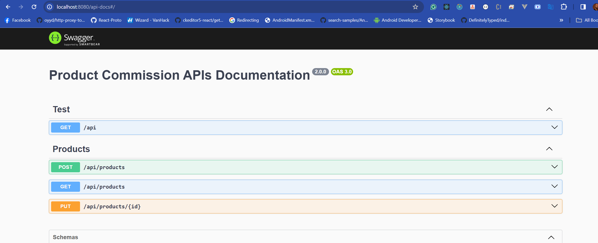

# Product Commission System

This project is a [monorepo](https://monorepo.tools/) containing a product commission system. It contains two folders, one for the server and then the other for the client side, as seen in the project structure.

# Application Architecture

The server is built on nestjs framework. It uses the domain driven architecture. While the client is built on nextjs.


## Layers

### API Layer

[NestJS + Express](https://nestjs.com/) acts as the API Layer for the architecture. It takes care of listening for client requests and calling the appropriate funtion to fulfill them.

### Persistence Layer

PostgreSQL is used as the database and Typeorm is used as the Object-Relational Mapper (ORM).

## Deployment

Deployment is done with containers in mind. A Docker Compose file is created to run the application.

## Project Structure

```
product-commission
├── product-commission-server
│    └── src
│       ├── applications
|       │   ├── assets
│       │   │    ├── dtos
│       │   │    ├── enum
│       │   │    ├── interface
│       │   │    └── response
│       │   ├── config
│       │   └── product
│       ├── domain
│       ├── exception
│       └── shared
├── product-commission-webapp
│    └── src
│         ├── api 
│         ├── app
│         ├── components
│         ├── config
│         ├── redux
│         ├── styles
│         ├── utils
│         └── pages
└── ...
```

### Project Structure

1. `product-commission-server` - This directory consists of the server project. All code relating to the API are in here.

2. `product-commission-webapp` - This directory consists of client side project. All UI and interactions are included in here.

4. `application/assets` - The assets directory contains all the enum, interface packages which are applied to the application

5. `/domain` - The domain directory contains the domain model of project.

6. `application` - The application directory contains the service/controller for the functionalities

## How to Run

1. Prerequisite: configure the following
- [Node.js](https://nodejs.org/en/) - v18 Recommended
- [Docker](https://docs.docker.com/get-docker/) - latest
- [Docker Compose](https://docs.docker.com/compose/install/) - latest

2. Create a `.env` file following the example of `.env.example` file in each of the projects and the root project then

3. Once the step 2 follow below steps:
   - Clone the project,
   - Install each of the project using `npm install`
   - You can start the development servers as both are not production read `npm run start:dev` (server) and `npm run dev` (client)

4. Once the step 3 is done, the API Gateway will listening on [http://localhost](http://localhost:8080) and the client would listen on [http://localhost](http://localhost:3000)

5. To test the API, head to the Swagger UI running at [http://localhost:8080/api-docs](http://localhost:8080/api-docs)
6. 
6. To test the client, kindly head to the page running at [http://localhost:3000/products](http://localhost:3000/products)

## Roadmap




### Todo: how to make it better

- [ ] Implement full authentication and authorization
- [ ] Implement order and staff functionalities
- [ ] Complete update for product
- [ ] Implement pagination on both ends
- [ ] Implement docker-componse to run currently on one command
- [ ] Modularize some components and structure the UI properly


### What was achieved
- [ ] Can create product from swagger docs
- [ ] Can get all products
- [ ] Can display products from frontend
- [ ] Used redux to manage state
- [ ] Validate fields from backend
- [ ] Follow the domain driven architecture on the API level